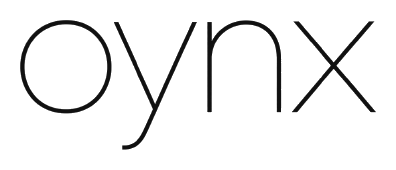

<p align="center">
  <picture>
    <source media="(prefers-color-scheme: dark)" srcset="docs/assets/logo-dark.png">
    
  </picture>
</p>

<p align="center">
  <b>A Nintendo 3DS emulator for Xbox, built on Azahar.</b><br>
  Couch-friendly, controller-first, made for Xbox Series X|S in Dev Mode.<br>
  <b>ALPHA software: early in development, expect rough edges.</b>
</p>

<p align="center">
  <a href="https://github.com/oledz-i/Onyx3DS/actions/workflows/build.yml"></a>
  <a href="LICENSE"></a>
  
  
</p>

---

ONYX wraps the [Azahar](https://github.com/azahar-emu/azahar) 3DS emulator core in a full-screen Xbox app: a game library with box art, per-game settings, save states, cheats and themes, all driven from a controller on the TV.

> [!WARNING]
> **ONYX is in ALPHA and still in its infancy.** It is not expected to work flawlessly
> yet. Games boot and are playable on a Series X/S, but many run slowly, some don't work
> at all, and the hardware renderer is still being brought up. Expect crashes, glitches
> and missing features while it grows. Bug reports with logs are very welcome (see
> [Reporting a bug](#reporting-a-bug)).

> [!IMPORTANT]
> **Only install ONYX from [Releases](https://github.com/oledz-i/Onyx3DS/releases/latest)** (numbered versions such as v2.1).
> Builds you may find in the **Actions** tab (named `DEV-BUILD-UNTESTED-…`) and the
> *Developer debug files* pre-release are **developer test builds**: untested, often
> broken, and replaced several times a day. They are not releases and are not supported.

## Features

- **Game library**: scans your ROM folder, reads titles and icons from the games themselves, and pulls box art from SteamGridDB.
- **Controller-first UI**: built for the TV and a gamepad, with five themes and optional menu music.
- **Save states**: multiple slots with thumbnails, plus an auto-save slot when you quit.
- **Per-game settings**: change resolution, CPU clock and more for one game without touching the rest.
- **Cheats**: downloads the cheat database for each game; toggle codes from the in-game menu.
- **Fast forward, screenshots, screen layouts**: all on controller hotkeys.
- **Custom textures and mods**: texture packs and LayeredFS mods (`romfs/`, `exefs/`, `code.ips`) per game, from folders you choose.
- **Crash protection**: emulator errors stop the game with an explanation instead of closing the app, and everything is written to a log you can share.

## Supported consoles

| Console | Status | Notes |
|---|---|---|
| **Xbox Series X** | Recommended | Most CPU and GPU headroom. |
| **Xbox Series S** | Supported | Main development and test console. |
| Xbox One / One S / One X | Not recommended | Untested. A low-resolution profile exists, but the older CPUs are likely too slow. |

All consoles need **Developer Mode** (see [Requirements](#requirements)). ONYX does not run in retail mode.

## Requirements

- An Xbox in **Developer Mode**. This needs a Microsoft Partner Center developer account, which has a one-time registration fee. Microsoft's guide: [Xbox Developer Mode activation](https://learn.microsoft.com/windows/uwp/xbox-apps/devkit-activation).
- **Decrypted** dumps of 3DS games you own, made with your own console. [GodMode9](https://github.com/d0k3/GodMode9) can dump and decrypt cartridges and installed titles.
- Optional: system files from your own 3DS (`aes_keys.txt`, `seeddb.bin`, shared fonts) for games that need them.
- A USB drive or the console's storage for your games.

### Supported game formats

| Format | Extension |
|---|---|
| Cartridge dump | `.3ds`, `.cci` (and compressed `.zcci`) |
| Executable / homebrew | `.cxi`, `.3dsx`, `.elf`, `.axf`, `.app` (and `.zcxi`, `.z3dsx`) |
| Updates & DLC | `.cia` (installed to the emulated SD card from Settings) |

Encrypted dumps are detected and flagged in the library. ONYX cannot decrypt them.

## Installation

The short version:

1. Download the latest release from [Releases](https://github.com/oledz-i/Onyx3DS/releases/latest): the `.msix` and the dependency `.appx`. Don't use builds from the Actions tab: those are untested developer builds.
2. Open the **Xbox Device Portal** in a browser on your PC and install two things: the ONYX `.msix` and the dependency in `Dependencies\x64`. Nothing else in the download is needed.
3. In **Dev Home**, highlight ONYX, press **Menu → View details**, and set **App type** to **Game**. This matters: as an *App*, Xbox gives it too little memory to emulate anything.
4. Launch ONYX, choose your ROM folder, and pick a game.

Step-by-step instructions, including the folder layout for system files and texture packs, are in **[docs/INSTALL.md](docs/INSTALL.md)**.

## Controls

The left side of the Xbox controller maps to the 3DS as you'd expect. Face buttons follow the 3DS's *positions* by default (Xbox **B** is 3DS **A**). Switch to label-matching in Settings.

| Xbox | 3DS |
|---|---|
| Left stick | Circle Pad |
| Right stick | C-Stick / touchscreen pointer |
| D-pad | D-pad |
| A / B / X / Y | B / A / Y / X (by position) |
| LB / RB | L / R |
| LT / RT | ZL / ZR |
| Menu | Start |
| View (tap) | Select |

**Hotkeys: hold View and press:**

| Button | Action |
|---|---|
| Menu | Open the in-game menu |
| RB (hold) | Fast forward |
| LB | Cycle screen layout |
| Y | Screenshot |
| A | Show / hide FPS |
| D-pad Up / Down | Save state / load state |
| D-pad Left / Right | Previous / next save slot |

## Settings worth knowing

| Setting | What it does |
|---|---|
| **Renderer** | *Software (safe)* draws on the CPU: slow, but it works everywhere. *Hardware (experimental)* uses Vulkan translated to DirectX 12; it's much faster when it works. |
| **CPU JIT** | Leave on. *Off* uses the interpreter, which is far slower and only meant as a fallback. |
| **Shader JIT** | Speeds up vertex shaders on the CPU, which helps the software renderer most. |
| **Profile** | Presets for Series S, Series X and Xbox One. Pick *Custom* to change everything yourself. |
| **System model** | *Original 3DS* is enough for most games and uses less memory than *New 3DS*. |

If the hardware renderer or the CPU JIT crashes, ONYX switches that setting to the safe option by itself and tells you.

## Reporting a bug

Please [open an issue](https://github.com/oledz-i/Onyx3DS/issues/new/choose) and attach the log. It's what turns "it crashed" into a fix.

1. Open the **Device Portal** → **File explorer**.
2. Go to `LocalAppData` → `ONYX3DS_…` → `LocalState`.
3. Download **`onyx.log`** (and `driver.log` if it's there).

Include your console, the game and its title ID (shown on the game's page), and your Renderer / CPU JIT settings.

## Building from source

Every push is built by [GitHub Actions](.github/workflows/build.yml) on Windows: Azahar (as a static libretro core for UWP), Dozen (Mesa's Vulkan-on-D3D12 driver), the shell library and its unit tests, then the signed Xbox package. The upstream projects are fetched at pinned commits and patched for Xbox from [`patches/`](patches).

To build locally on Windows with Visual Studio 2022 (Desktop C++ and UWP workloads) and PowerShell 7:

```powershell
./tools/fetch-deps.ps1     # Azahar, Mesa, DXIL.dll, NuGet packages, headers
./tools/build-all.ps1      # Azahar + Dozen + shell + app, then the .msix
```

The portable `shell/` library (library, settings, cheats, achievements) builds and tests on any OS:

```sh
cmake -S shell -B build && cmake --build build && ./build/onyx_shell_tests
```

## Project layout

```
app/        Xbox (UWP, C++/WinRT) app: UI pages, emulator session, D3D12 presenter
shell/      Portable library: game library, settings, cheats, art, achievements (+ tests)
patches/    Xbox patches for Azahar, dynarmic, Mesa (Dozen), Boost, Crypto++
tools/      Build scripts used locally and by CI
third_party/  doctest, nlohmann/json, rcheevos
```

## Credits

ONYX stands on the work of these projects:

- [Azahar](https://github.com/azahar-emu/azahar): the 3DS emulator core (GPL-3.0-or-later), itself continuing Citra
- [dynarmic](https://github.com/azahar-emu/dynarmic): ARM dynamic recompiler
- [Mesa / Dozen](https://gitlab.freedesktop.org/mesa/mesa): Vulkan on Direct3D 12 (MIT)
- [rcheevos](https://github.com/RetroAchievements/rcheevos): RetroAchievements client (MIT)
- [SteamGridDB](https://www.steamgriddb.com): box art
- [nlohmann/json](https://github.com/nlohmann/json) and [doctest](https://github.com/doctest/doctest) (MIT)

## Legal

ONYX is licensed under the [GNU GPL v3.0 or later](LICENSE).

ONYX does not include, download or link to games, BIOS or system files. Use it only with games and files dumped from hardware you own. ONYX is not affiliated with, endorsed by, or sponsored by Nintendo or Microsoft. Nintendo 3DS is a trademark of Nintendo; Xbox is a trademark of Microsoft.
